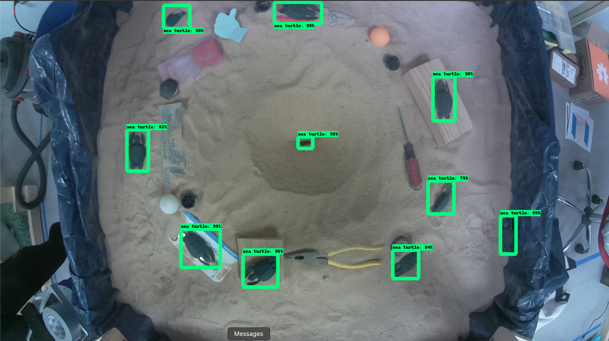
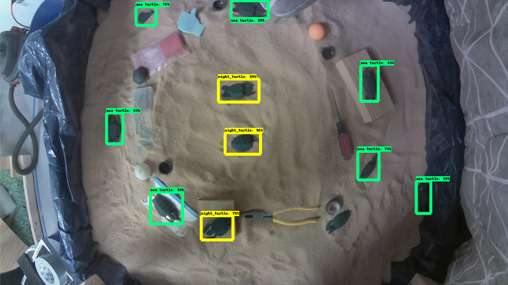
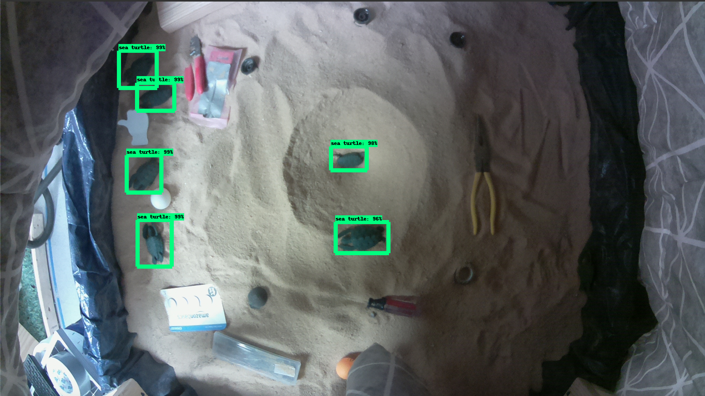
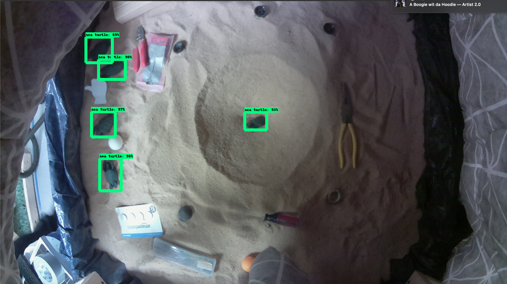
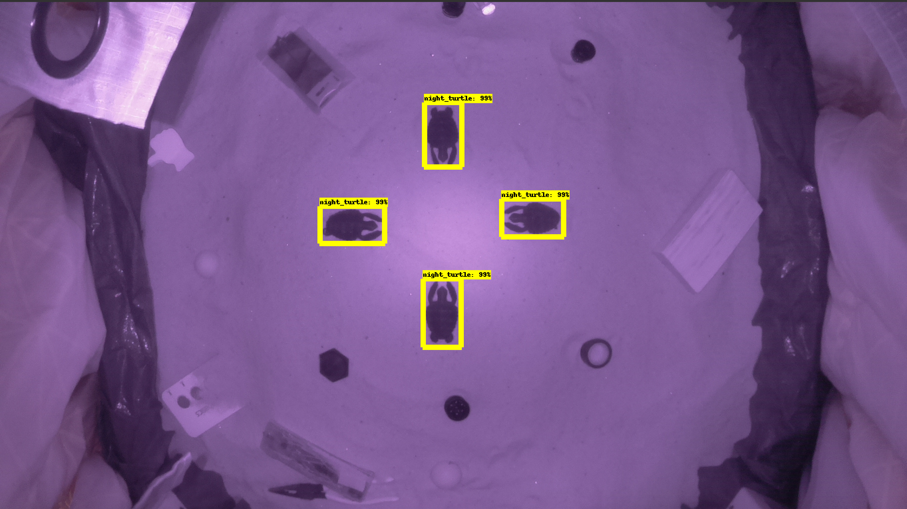
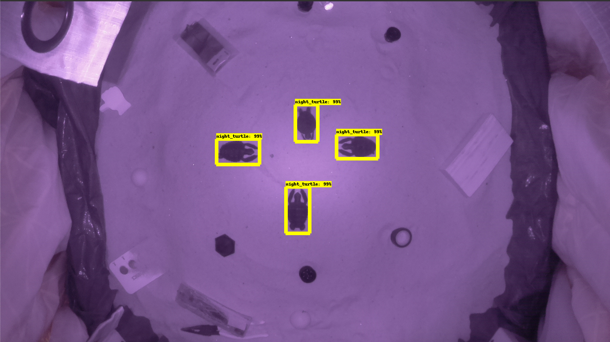
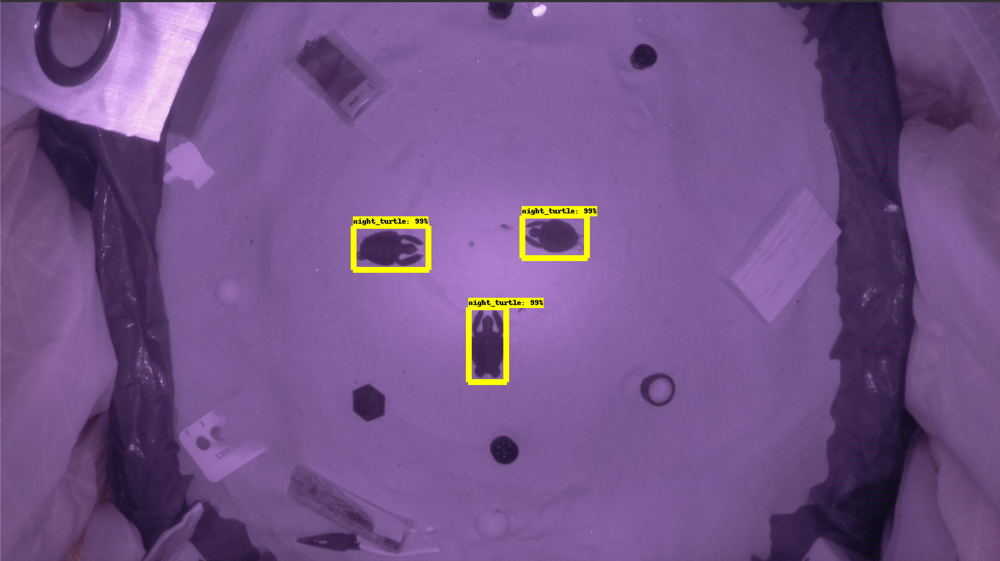
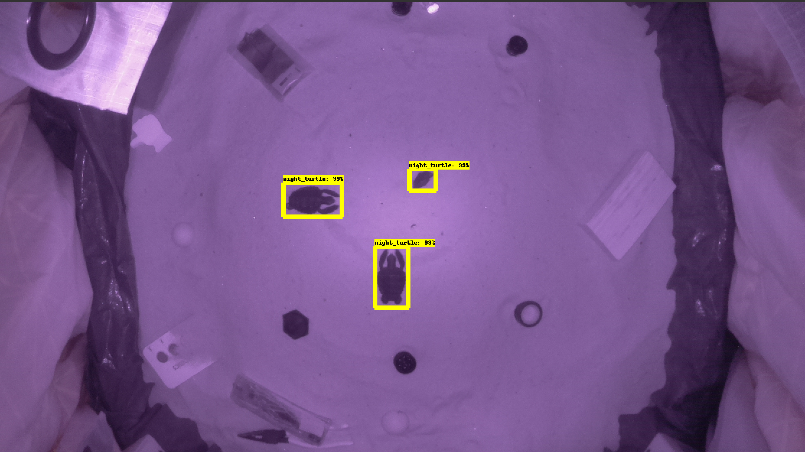

# STNAS
My team of four ECE students and I took on the task of being the first semester of students to work on the Sea Turtle Nestling Alarm System(STNAS) senior design project at NC State University. That being said, our senior design project was developing the proof of concept for the STNAS project. This included a [website](https://sites.google.com/ncsu.edu/stnas/stnas), embedded system, video analytics, PCBs, sensors, cloud integration, wireless communication, testing environment, and implementation design.

My two main contributions to this project were developing the Sandbox testing environment which included overseeing its construction, and developing the machine learning model to accurately detect our 3D printed baby sea turtle models in a wide range of lighting conditions.

## Sandbox
As our testing environment needed to simulate a real sea turtle nest, give consistent results, and be quickly and easily repeatable

## Turtle Detection: Day

## Turtle Detection: Twilight

## Turtle Detection: Dusk

## Turtle Detection: Night

